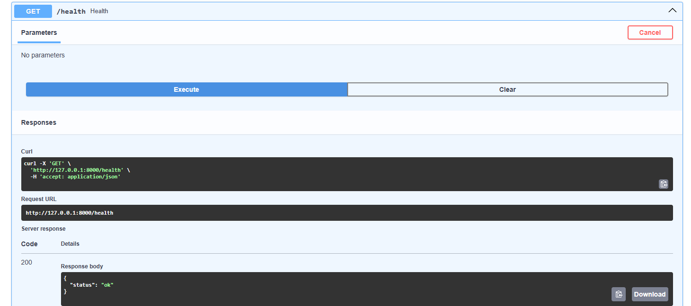
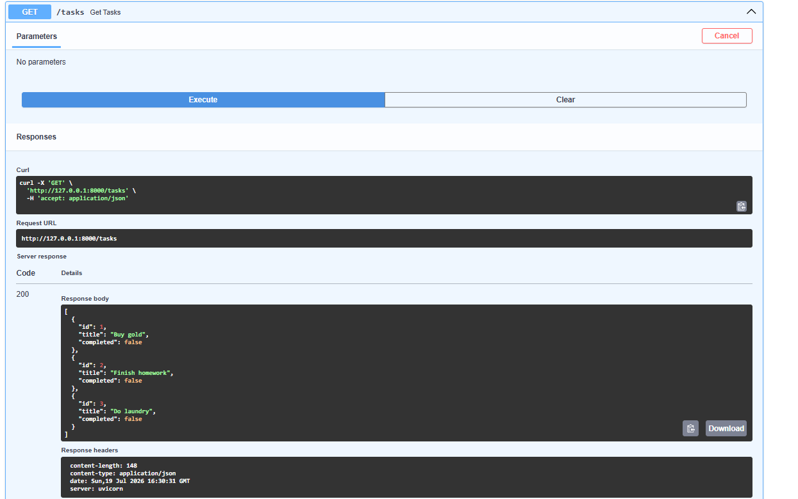
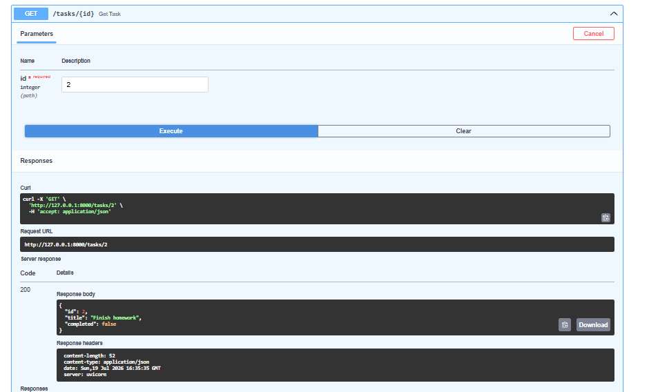
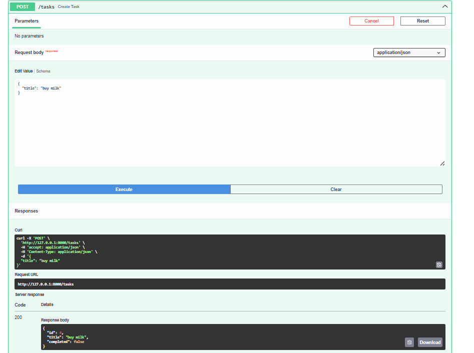
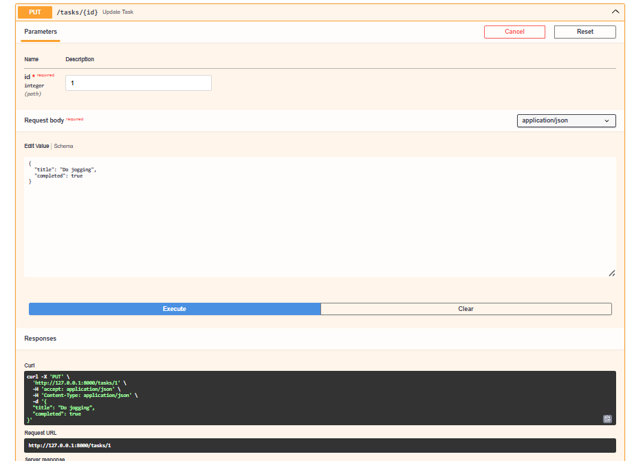
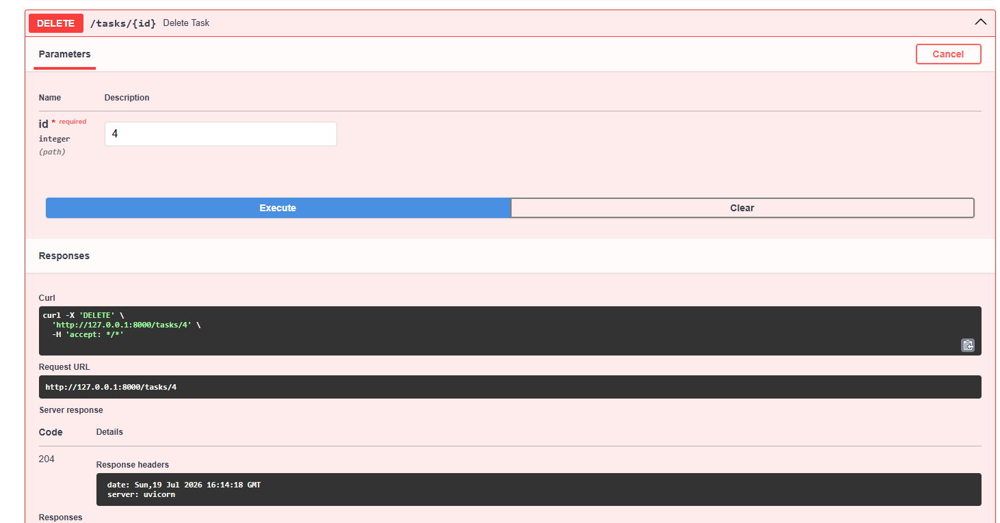

# Task CRUD API

A simple REST API built with FastAPI that demonstrates CRUD (Create, Read, Update, Delete) operations using an in-memory list as the data store.

## Features

- Create a task
- Read all tasks
- Read a task by ID
- Update a task
- Delete a task
- Health check endpoint
- Automatic API documentation with Swagger UI

---

## Tech Stack

- Python 3
- FastAPI
- Uvicorn

---

## Installation

### Clone the repository

```bash
git clone <your-repository-url>
cd task-api
```

### Install dependencies

```bash
pip install fastapi uvicorn
```

---

## Run the application

```bash
uvicorn main:app --reload
```

The API will be available at:

- http://127.0.0.1:8000
- Swagger UI: http://127.0.0.1:8000/docs

---

## API Endpoints

| Method | Endpoint      | Description       | Success Status |
| ------ | ------------- | ----------------- | -------------- |
| GET    | `/`           | API information   | 200 OK         |
| GET    | `/health`     | Health check      | 200 OK         |
| GET    | `/tasks`      | Get all tasks     | 200 OK         |
| GET    | `/tasks/{id}` | Get task by ID    | 200 OK         |
| POST   | `/tasks`      | Create a new task | 201 Created    |
| PUT    | `/tasks/{id}` | Update a task     | 200 OK         |
| DELETE | `/tasks/{id}` | Delete a task     | 204 No Content |

### 📸 Endpoints Visual Demonstration

#### Health Check (`GET /health`)


#### Get All Tasks (`GET /tasks`)


#### Get Task by ID (`GET /tasks/{id}`)


#### Create Task (`POST /tasks`)


#### Update Task (`PUT /tasks/{id}`)


#### Delete Task (`DELETE /tasks/{id}`)


---

## Example Task

```json
{
  "id": 1,
  "title": "Buy gold",
  "completed": false
}
```

---

## Example curl Request

Create a new task:

```bash
curl -i -X POST http://127.0.0.1:8000/tasks \
-H "Content-Type: application/json" \
-d '{"title":"Buy milk"}'
```

Example response:

```http
HTTP/1.1 201 Created
content-type: application/json

{
  "id": 4,
  "title": "Buy milk",
  "completed": false
}
```

---

## Sample Data

```json
[
  {
    "id": 1,
    "title": "Buy gold",
    "completed": false
  },
  {
    "id": 2,
    "title": "Finish homework",
    "completed": false
  },
  {
    "id": 3,
    "title": "Do laundry",
    "completed": false
  }
]
```

---

## Error Responses

### Task not found

```json
{
  "error": "Task 99 not found"
}
```

Status Code:

```
404 Not Found
```

### Invalid Request

```json
{
  "error": "Title is required"
}
```

Status Code:

```
400 Bad Request
```

---

## Project Structure

```
task-api/
│
├── main.py
├── README.md
└── requirements.txt
```

---

## Author

Khilesh Bhangale
