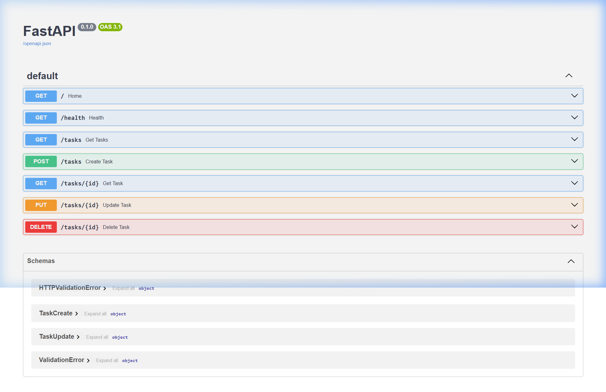

# FastAPI Task CRUD API

A simple, lightweight RESTful API built with **FastAPI** to manage a to-do list. The application stores tasks in memory (no external database or files required) and provides full CRUD capabilities, input validation, and automatic Swagger documentation.

---

## 🛠️ Installation & Quick Start

To install dependencies and run the application in a single step, execute the following command in your terminal:

```bash
# On Windows (PowerShell):
python -m venv .venv; .venv\Scripts\activate; pip install fastapi uvicorn; uvicorn main:app --reload

# On macOS / Linux (bash/zsh):
python3 -m venv .venv && source .venv/bin/activate && pip install fastapi uvicorn && uvicorn main:app --reload
```

---

## 🛣️ API Endpoints

| Method | Endpoint | Description | Success Status | Error Status |
| :--- | :--- | :--- | :--- | :--- |
| **GET** | `/` | Retrieve API metadata | `200 OK` | - |
| **GET** | `/health` | Verify server health status | `200 OK` | - |
| **GET** | `/tasks` | Retrieve all task list | `200 OK` | - |
| **GET** | `/tasks/{id}` | Retrieve details of a specific task | `200 OK` | `404 Not Found` |
| **POST** | `/tasks` | Create a new task (requires `title`) | `200 OK` | `400 Bad Request` |
| **PUT** | `/tasks/{id}` | Update task title and completion status | `200 OK` | `400 Bad Request`, `404 Not Found` |
| **DELETE** | `/tasks/{id}` | Delete a task | `204 No Content` | `404 Not Found` |

---

## 💻 Sample API Request & Response (`curl -i`)

Here is an example request to fetch all tasks:

```http
$ curl -i http://127.0.0.1:8000/tasks
HTTP/1.1 200 OK
date: Sun, 19 Jul 2026 16:57:36 GMT
server: uvicorn
content-length: 148
content-type: application/json

[{"id":1,"title":"Buy gold","completed":false},{"id":2,"title":"Finish homework","completed":false},{"id":3,"title":"Do laundry","completed":false}]
```

---

## 📸 Swagger UI Documentation

FastAPI automatically generates interactive Swagger documentation. You can access it locally at [http://127.0.0.1:8000/docs](http://127.0.0.1:8000/docs).



---

## 🤖 AI vs Me

### 📝 The Initial Prompt (Written from Memory)
```text
Hey! Can you build me a simple to-do list REST API in Python using FastAPI?

I want to store tasks in memory (no databases or external files). Each task needs to have an id, a title, and a done boolean. Also, please seed the app with 3 sample tasks when it starts up.

Here are the endpoints I need:
- GET /tasks to retrieve all tasks.
- GET /tasks/{id} to get a specific task by id (return 404 with {"error": "..."} if it's not found).
- POST /tasks to create a task (make sure title is a non-empty string; if it's missing or empty, return 400 with {"error": "..."}).
- PUT /tasks/{id} to update task title and done status. If the title is empty, return 400 with {"error": "..."}. If the ID doesn't exist, return 404.
- DELETE /tasks/{id} to delete a task (returns 204. If not found, return 404).

Make sure all validation or general error responses are returned in JSON format like {"error": "message"}. Oh, and make sure it has Swagger UI available at /docs. Keep the code simple and runnable in a single main.py file!
```

### 🔍 Concrete Differences Found
1. **Consistently structured task schema**: The hand-built codebase had a major structural bug where the seeded database used `completed: bool` as the status key, but `update_task` checked for `updated_task.done`. Since `TaskUpdate` only had `completed`, attempting to update a task would crash with an `AttributeError`. The AI version cleanly defined and used `done` everywhere, avoiding this runtime bug.
2. **Error response payload format**: The AI version initially used FastAPI's built-in `HTTPException`, which returned error payloads in the format `{"detail": "..."}` instead of the requested `{"error": "..."}`.
3. **Invalid body status code (422 vs 400)**: Sending a payload with a missing title to the AI's `POST /tasks` endpoint returned a `422 Unprocessable Content` status code (due to default FastAPI/Pydantic validation) rather than the required `400 Bad Request`.

---

### ❓ Questions & Answers

#### 1. What did the AI do better — and do you understand its version well enough to explain it?
The AI correctly aligned the schemas and consistently used the variable `done` for the task completion status across all data models and business logic. It also used FastAPI's `response_model` argument in the decorators to automatically serialize and filter the returned list and task dictionaries, which is cleaner and safer than raw dictionary returns.

#### 2. What did it get wrong or quietly ignore from your prompt?
- It ignored the error response shape constraint: it returned `{"detail": "..."}` instead of `{"error": "..."}`.
- It ignored returning a `400` status code for missing schema fields, defaulting instead to FastAPI's standard `422` validation failure response.

#### 3. What did your prompt forget to specify — and what did the AI silently decide for you?
The prompt forgot to explicitly describe how to handle FastAPI's default request validation exception (`RequestValidationError`). Consequently, the AI silently decided to let FastAPI's default exception handlers catch the validation errors, producing a `422 Unprocessable Content` instead of the expected `400 Bad Request`.

---

### 🔄 The Rematch Prompt & What Changed
To fix the differences, the prompt was updated to explicitly override FastAPI's default handlers:
```text
Hey, the code looks great but we need to tweak how errors and validation are handled.

Right now, FastAPI's default request validation throws a 422 Unprocessable Entity and returns standard nested validation details. But I need all validation failures (e.g., if fields are missing in the request body, or have invalid types) to return a 400 Bad Request with the JSON format {"error": "detailed message"}.

Could you register a custom exception handler for FastAPI's RequestValidationError so that any validation errors are automatically caught and returned as a 400 Bad Request with a clear message inside {"error": "..."}? Please make sure every other error response is also in {"error": "..."} format. Keep everything else in memory and running on /docs.
```
**In the rematch, the AI successfully registered a custom exception handler for `RequestValidationError` to capture default validation failures and return `400 Bad Request` with the `{"error": "..."}` JSON structure.**
