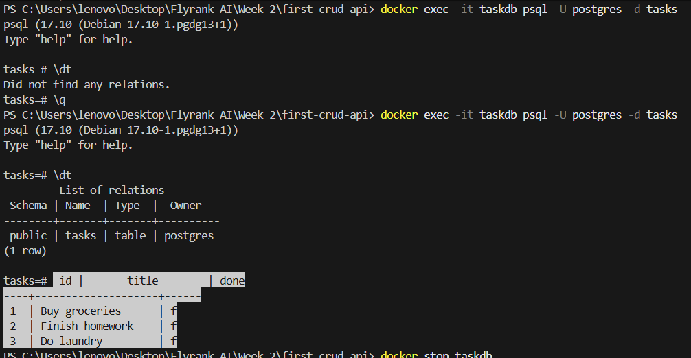
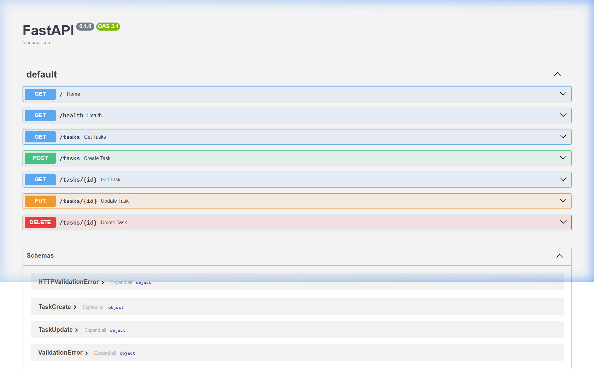
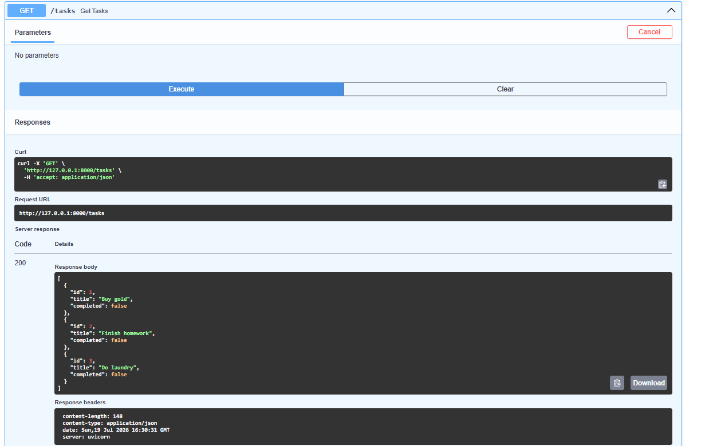
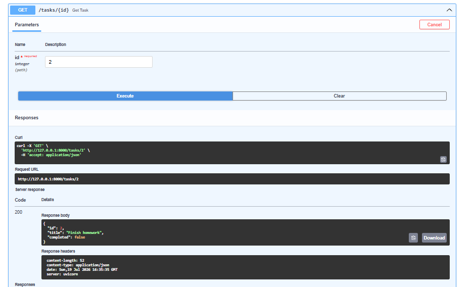
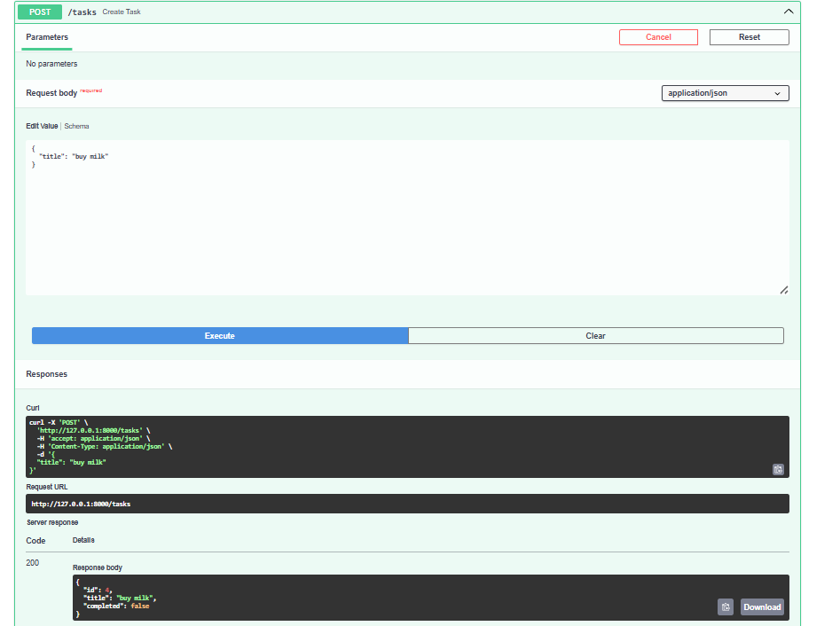
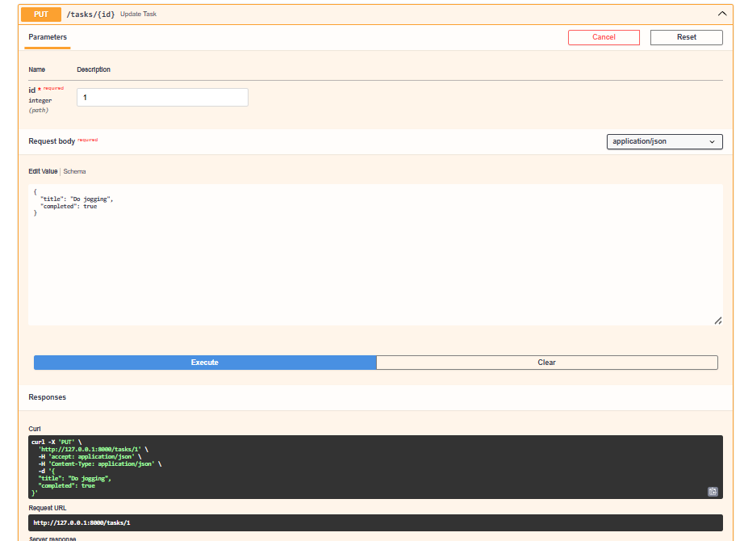
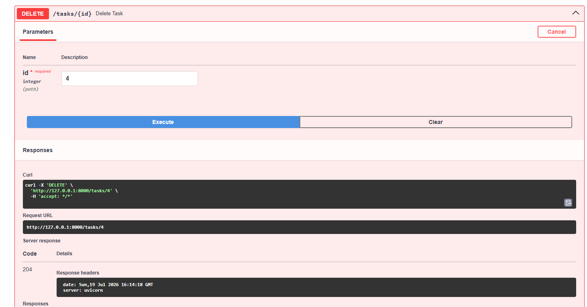
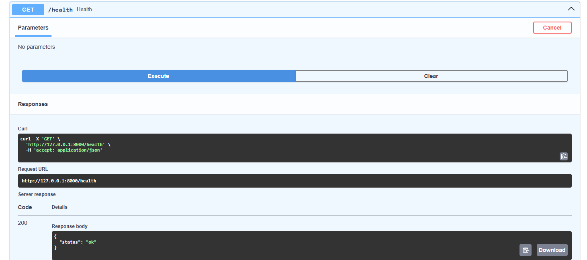
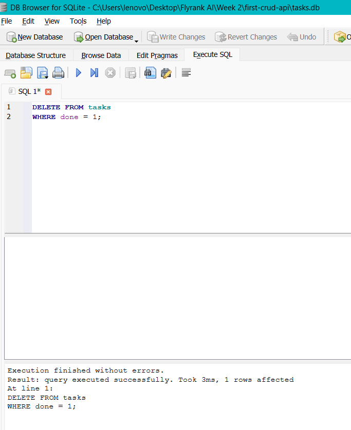

# ⚡ FastAPI CRUD API with PostgreSQL

[](https://fastapi.tiangolo.com/)
[](https://www.postgresql.org/)
[](https://www.docker.com/)
[](https://www.python.org/)

---

## 📌 Overview

A production-ready RESTful API built using **FastAPI** and **PostgreSQL** (via `psycopg3`). The application is fully containerized using **Docker** and **Docker Compose**, providing automated database initialization, sample data seeding, strict input validation, and interactive Swagger documentation.

---

## 🛠️ Tech Stack

- **Framework:** [FastAPI](https://fastapi.tiangolo.com/)
- **Database:** [PostgreSQL 17](https://www.postgresql.org/)
- **Database Driver:** [Psycopg 3](https://www.psycopg.org/psycopg3/)
- **Containerization:** Docker & Docker Compose
- **Language:** Python 3.12

---

## 🚀 Quick Start & Running the Project

### 1. Clone the Repository

```bash
git clone <YOUR_REPOSITORY_URL>
cd first-crud-api
```

### 2. Configure Environment Variables

Copy the example environment configuration:

```bash
cp .env.example .env
```

### 3. Start Application with Docker Compose

Run the following single command to build and launch all containers (API + PostgreSQL):

```bash
docker compose up --build
```

---

## 🌐 Access Points

Once started, the services are available at:

- **API Base URL:** `http://localhost:3000`
- **Interactive Swagger UI:** `http://localhost:3000/docs`
- **ReDoc Documentation:** `http://localhost:3000/redoc`

---

## 🔑 Environment Variables

Configuration is handled via `.env`. Refer to `.env.example` for required variables:

```env
DATABASE_URL=postgres://postgres:dev@db:5432/tasks
```

---

## 🛣️ API Endpoints

| Method | Endpoint | Description | Success Status | Error Status |
| :--- | :--- | :--- | :--- | :--- |
| `GET` | `/` | Retrieve API Metadata | `200 OK` | - |
| `GET` | `/health` | Server & Database Health Check | `200 OK` | - |
| `GET` | `/tasks` | List all tasks | `200 OK` | - |
| `GET` | `/tasks/{task_id}` | Retrieve details of a specific task | `200 OK` | `404 Not Found` |
| `POST` | `/tasks` | Create a new task | `201 Created` | `400 Bad Request` |
| `PUT` | `/tasks/{task_id}` | Update task title and status | `200 OK` | `400 Bad Request`, `404 Not Found` |
| `DELETE` | `/tasks/{task_id}` | Delete a task | `204 No Content` | `404 Not Found` |

---

## 💻 Sample `curl` Requests

### Create a Task (`POST /tasks`)

```bash
curl -i -X POST http://localhost:3000/tasks \
  -H "Content-Type: application/json" \
  -d '{"title": "Learn Docker"}'
```

**Response (`201 Created`):**
```http
HTTP/1.1 201 Created
content-type: application/json

{
  "id": 1,
  "title": "Learn Docker",
  "done": false
}
```

### Retrieve All Tasks (`GET /tasks`)

```bash
curl -i http://localhost:3000/tasks
```

**Response (`200 OK`):**
```json
[
  {
    "id": 1,
    "title": "Buy groceries",
    "done": false
  },
  {
    "id": 2,
    "title": "Finish homework",
    "done": false
  },
  {
    "id": 3,
    "title": "Do laundry",
    "done": false
  }
]
```

---

## 🐳 Docker Containers & Setup Screenshots

The application runs seamlessly in Docker containers using `docker compose`.

### Container Status & Screenshots




### Docker Management Commands

| Action | Command |
| :--- | :--- |
| **Start Services** | `docker compose up -d` |
| **View Service Logs** | `docker compose logs -f` |
| **Stop Services** | `docker compose down` |
| **Stop & Remove Volumes** | `docker compose down -v` |
| **Rebuild Containers** | `docker compose up --build` |

---

## 📸 Interactive API Documentation (Swagger UI)

FastAPI automatically generates interactive API documentation. Explore and test endpoints live via the browser at `http://localhost:3000/docs`.



### Endpoint Demonstrations

<details>
<summary><b>🔍 View Endpoint UI Screenshots</b></summary>

#### GET /tasks


#### GET /tasks/{id}


#### POST /tasks


#### PUT /tasks/{id}


#### DELETE /tasks/{id}


#### GET /health


</details>

---

## 🗄️ Database Inspection & Verification

You can inspect the running PostgreSQL instance directly inside its container.

### Connect via `psql` CLI:

```bash
docker exec -it taskdb psql -U postgres -d tasks
```

Inside the PostgreSQL shell, run:

```sql
-- List tables
\dt

-- Query seeded tasks table
SELECT * FROM tasks;
```

### Visual Database Inspection

Below is a live database state verification screenshot showing active records and SQL operations:


